


 

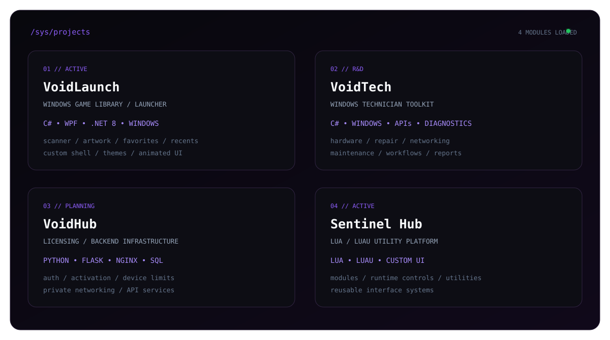

 

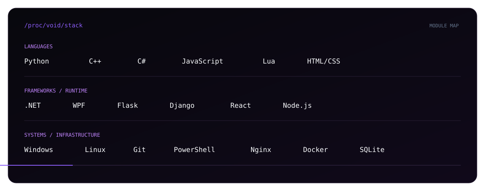

 


 

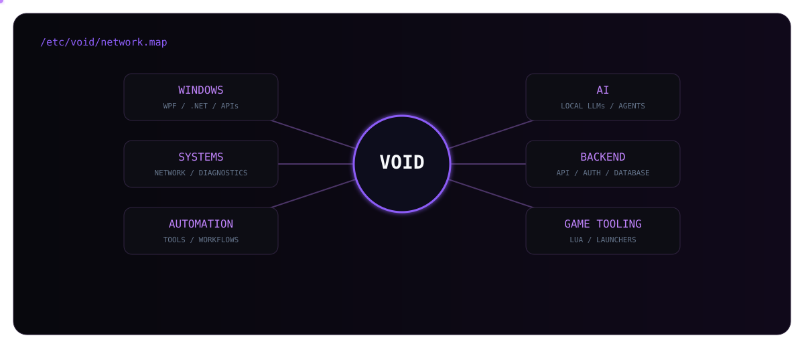

 

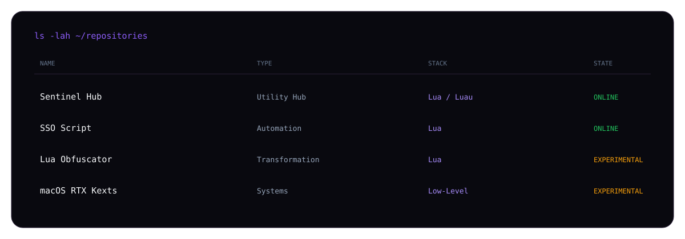

 

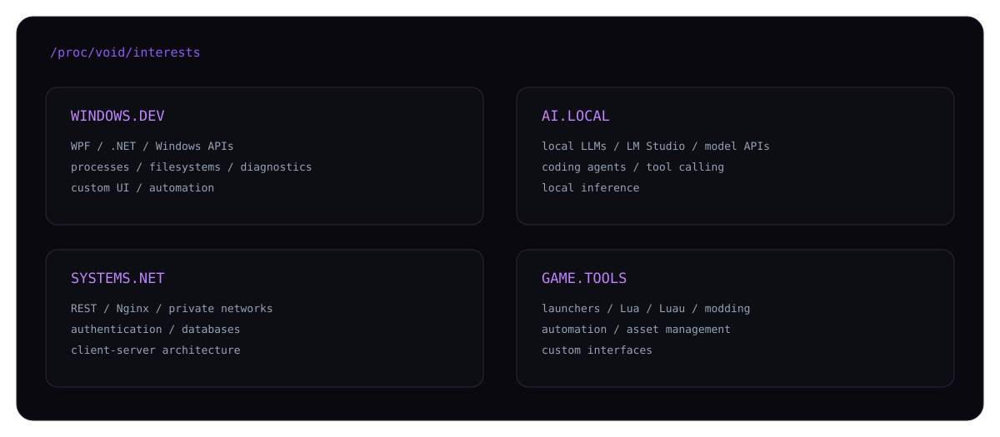

 

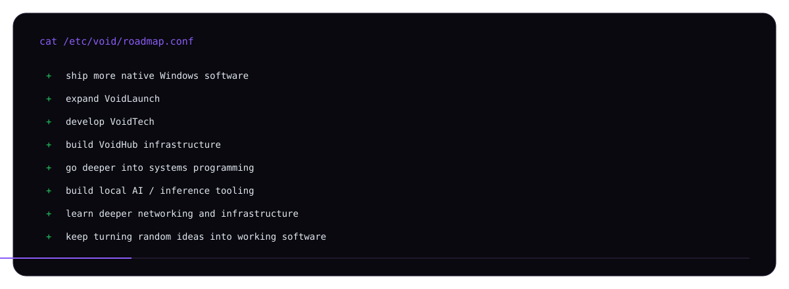

 

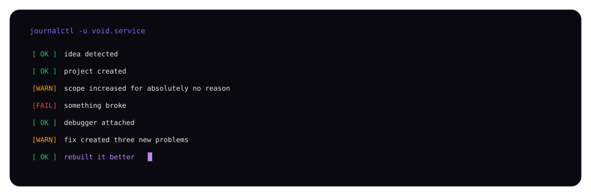

  

<a href="https://github.com/Vvoidddd">
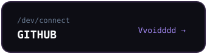
</a>

<a href="https://discord.gg/Mv3CdFKWrD">
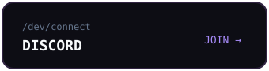
</a>

<a href="https://www.roblox.com/users/88469511/profile">
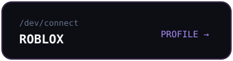
</a>

  

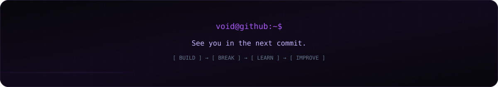

