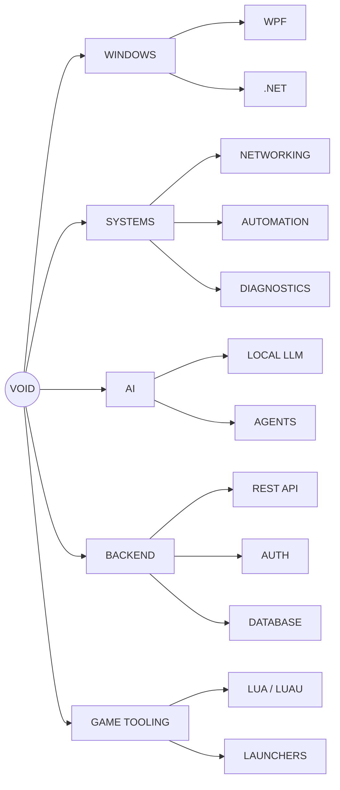

<div align="center">


<br>

<a href="https://github.com/Vvoidddd?tab=followers">

</a>


<a href="https://github.com/Vvoidddd?tab=repositories">

</a>

</div>


## `VOID://IDENTITY`

```yaml
alias: Void

role:
  - Software Developer
  - Systems Builder

environment:
  os: Windows 11

languages:
  - Python
  - C++
  - C#
  - JavaScript
  - Lua
  - HTML
  - CSS

focus:
  - Windows Software
  - Systems
  - Networking
  - Automation
  - Artificial Intelligence
  - Local LLMs
  - Backend Infrastructure
  - Game Tooling
````

<div align="center">

### `I build things I actually want to use.`

`BUILD` → `BREAK` → `UNDERSTAND` → `IMPROVE`

</div>


# `VOID://PROJECTS`

<table>
<tr>

<td width="50%" valign="top">

## ⚡ VoidLaunch

### Windows Game Launcher

A custom Windows launcher focused on automatically discovering and organizing installed games.

```text
C# / WPF / .NET 8 / Windows
```

**SYSTEMS**

* Automatic game detection
* Executable discovery
* Cover artwork
* Favorites
* Recently played
* Custom window framework
* Theme engine
* Animated interface

```diff
+ ACTIVE DEVELOPMENT
```

</td>

<td width="50%" valign="top">

## 🛠️ VoidTech

### Windows Technician Toolkit

A professional toolkit designed to automate PC diagnostics, troubleshooting, repair and maintenance.

```text
C# / Windows / APIs / Diagnostics
```

**SYSTEMS**

* Hardware diagnostics
* Windows repair
* Network tools
* System information
* Maintenance automation
* Technician workflows
* Reporting

```diff
+ RESEARCH / DEVELOPMENT
```

</td>

</tr>

<tr>

<td width="50%" valign="top">

## 🔐 VoidHub

### Backend Infrastructure

Licensing and authentication infrastructure powering the Void ecosystem.

```text
Python / Flask / Nginx / SQL
```

```text
VOIDTECH
   │
   ▼
 NGINX
   │
   ▼
VOIDHUB
   │
   ▼
DATABASE
```

**SYSTEMS**

* License management
* Device activation
* Machine limits
* Expiration tracking
* Authentication
* Private networking

</td>

<td width="50%" valign="top">

## 🛰️ Sentinel Hub

### Lua / Luau Utility Platform

Modular scripting environment built around custom UI and reusable runtime systems.

```text
Lua / Luau / UI
```

**SYSTEMS**

* Modular architecture
* Custom interface
* Runtime controls
* Utility framework

### [OPEN REPOSITORY →](https://github.com/Vvoidddd/Sentinel-Hub)

</td>

</tr>
</table>


# `VOID://TECH`

<div align="center">

### LANGUAGES


<br><br>

### SOFTWARE


<br><br>

### SYSTEMS


<br><br>

### DEVELOPMENT


</div>


# `VOID://TELEMETRY`

<div align="center">

### CONTRIBUTION STREAK


<br><br>

### DEVELOPER ACTIVITY


<br>


</div>


# `VOID://NETWORK`




# `VOID://PUBLIC_REPOSITORIES`

| Repository                                                     | System         | Stack        | State          |
| -------------------------------------------------------------- | -------------- | ------------ | -------------- |
| [Sentinel Hub](https://github.com/Vvoidddd/Sentinel-Hub)       | Utility Hub    | `Lua` `Luau` | `ONLINE`       |
| [SSO Script](https://github.com/Vvoidddd/SSO-Script)           | Automation     | `Lua`        | `ONLINE`       |
| [Lua Obfuscator](https://github.com/Vvoidddd/Lua-Obfuscator)   | Transformation | `Lua`        | `EXPERIMENTAL` |
| [macOS RTX Kexts](https://github.com/Vvoidddd/macOS-RTX-Kexts) | Systems        | `Low Level`  | `EXPERIMENTAL` |


# `VOID://ROADMAP`

```diff
+ Build more native Windows software
+ Push deeper into systems programming
+ Expand VoidLaunch
+ Develop VoidTech
+ Build VoidHub infrastructure
+ Experiment with local LLM systems
+ Create AI powered developer tools
+ Learn deeper networking
+ Keep building weird shit
```


# `VOID://PHILOSOPHY`

<div align="center">

```text
┌───────────────────────────────────────────────────────────────┐
│                                                               │
│   SOFTWARE IS MORE INTERESTING WHEN YOU UNDERSTAND            │
│   WHAT'S HAPPENING UNDERNEATH IT.                             │
│                                                               │
│            BUILD → BREAK → LEARN → REBUILD                    │
│                                                               │
└───────────────────────────────────────────────────────────────┘
```

</div>


# `VOID://CONNECT`

<div align="center">

<a href="https://github.com/Vvoidddd">

</a>

<a href="https://discord.gg/Mv3CdFKWrD">

</a>

<a href="https://www.roblox.com/users/88469511/profile">

</a>

</div>

<br>


```

Now the part that actually makes it stand out:

## `assets/void-header.svg`

This isn't another generic Capsule Render header. It's yours.

```svg
<svg
    width="1200"
    height="330"
    viewBox="0 0 1200 330"
    xmlns="http://www.w3.org/2000/svg">

    <defs>

        <linearGradient id="background" x1="0" y1="0" x2="1" y2="1">
            <stop offset="0%" stop-color="#07070c"/>
            <stop offset="50%" stop-color="#0d0918"/>
            <stop offset="100%" stop-color="#07070c"/>
        </linearGradient>

        <linearGradient id="purple" x1="0" y1="0" x2="1" y2="0">
            <stop offset="0%" stop-color="#6d28d9"/>
            <stop offset="50%" stop-color="#a855f7"/>
            <stop offset="100%" stop-color="#7c3aed"/>
        </linearGradient>

        <filter id="glow">
            <feGaussianBlur stdDeviation="5" result="blur"/>
            <feMerge>
                <feMergeNode in="blur"/>
                <feMergeNode in="SourceGraphic"/>
            </feMerge>
        </filter>

        <pattern
            id="grid"
            width="40"
            height="40"
            patternUnits="userSpaceOnUse">

            <path
                d="M 40 0 L 0 0 0 40"
                fill="none"
                stroke="#8b5cf6"
                stroke-width="0.5"
                opacity="0.10"/>

        </pattern>

    </defs>


    <!-- BACKGROUND -->

    <rect
        width="1200"
        height="330"
        rx="18"
        fill="url(#background)"
    />

    <rect
        width="1200"
        height="330"
        rx="18"
        fill="url(#grid)"
    />


    <!-- TOP BAR -->

    <circle cx="34" cy="28" r="6" fill="#ef4444"/>
    <circle cx="54" cy="28" r="6" fill="#eab308"/>
    <circle cx="74" cy="28" r="6" fill="#22c55e"/>

    <text
        x="100"
        y="34"
        font-family="monospace"
        font-size="14"
        fill="#64748b">
        void@github ~/profile
    </text>


    <!-- MAIN VOID TEXT -->

    <text
        x="600"
        y="150"
        text-anchor="middle"
        font-family="monospace"
        font-size="82"
        font-weight="800"
        letter-spacing="18"
        fill="url(#purple)"
        filter="url(#glow)">
        VOID
    </text>


    <!-- SUBTITLE -->

    <text
        x="600"
        y="205"
        text-anchor="middle"
        font-family="monospace"
        font-size="20"
        letter-spacing="4"
        fill="#c4b5fd">

        SOFTWARE • SYSTEMS • AI

    </text>


    <!-- TERMINAL LINE -->

    <text
        x="600"
        y="258"
        text-anchor="middle"
        font-family="monospace"
        font-size="16"
        fill="#64748b">

        void@system:~$

        <tspan fill="#a855f7">
            building_something_new
        </tspan>

        <tspan>
            _
        </tspan>

        <animate
            attributeName="opacity"
            values="1;1;0;0;1"
            dur="1s"
            repeatCount="indefinite"/>

    </text>


    <!-- BOTTOM GLOW LINE -->

    <rect
        x="170"
        y="300"
        width="860"
        height="2"
        fill="url(#purple)"
        opacity="0.9"
        filter="url(#glow)"
    />

</svg>
```

That gives you this whole **cyber terminal / custom dev OS** vibe instead of the standard waving-gradient shit everybody has.

---

## `assets/neon-divider.svg`

```svg
<svg
    width="1200"
    height="38"
    viewBox="0 0 1200 38"
    xmlns="http://www.w3.org/2000/svg">

    <defs>

        <linearGradient id="line">
            <stop offset="0%" stop-color="#8b5cf6" stop-opacity="0"/>
            <stop offset="20%" stop-color="#8b5cf6"/>
            <stop offset="50%" stop-color="#c084fc"/>
            <stop offset="80%" stop-color="#8b5cf6"/>
            <stop offset="100%" stop-color="#8b5cf6" stop-opacity="0"/>
        </linearGradient>

        <filter id="glow">
            <feGaussianBlur stdDeviation="3"/>
        </filter>

    </defs>

    <rect
        x="100"
        y="18"
        width="1000"
        height="2"
        fill="url(#line)"
        filter="url(#glow)">
        
        <animate
            attributeName="opacity"
            values="0.35;1;0.35"
            dur="4s"
            repeatCount="indefinite"/>

    </rect>

    <rect
        x="100"
        y="18"
        width="1000"
        height="1"
        fill="url(#line)"
    />

</svg>
```

So instead of boring:

```text
-------------------------
```

every section gets a glowing purple divider.

---

# `assets/void-footer.svg`

```svg
<svg
    width="1200"
    height="170"
    viewBox="0 0 1200 170"
    xmlns="http://www.w3.org/2000/svg">

    <defs>

        <linearGradient id="bg">
            <stop offset="0%" stop-color="#09090f"/>
            <stop offset="100%" stop-color="#12091f"/>
        </linearGradient>

        <linearGradient id="purple">
            <stop offset="0%" stop-color="#6d28d9"/>
            <stop offset="50%" stop-color="#c084fc"/>
            <stop offset="100%" stop-color="#6d28d9"/>
        </linearGradient>

        <filter id="glow">
            <feGaussianBlur stdDeviation="4"/>
        </filter>

    </defs>

    <rect
        width="1200"
        height="170"
        rx="18"
        fill="url(#bg)"
    />

    <text
        x="600"
        y="68"
        text-anchor="middle"
        font-family="monospace"
        font-size="20"
        fill="#a855f7">
        void@github:~$
    </text>

    <text
        x="600"
        y="105"
        text-anchor="middle"
        font-family="monospace"
        font-size="16"
        fill="#94a3b8">
        See you in the next commit.
    </text>

    <rect
        x="300"
        y="135"
        width="600"
        height="2"
        fill="url(#purple)"
        filter="url(#glow)">

        <animate
            attributeName="width"
            values="150;600;150"
            dur="5s"
            repeatCount="indefinite"/>

        <animate
            attributeName="x"
            values="525;300;525"
            dur="5s"
            repeatCount="indefinite"/>

    </rect>

</svg>
