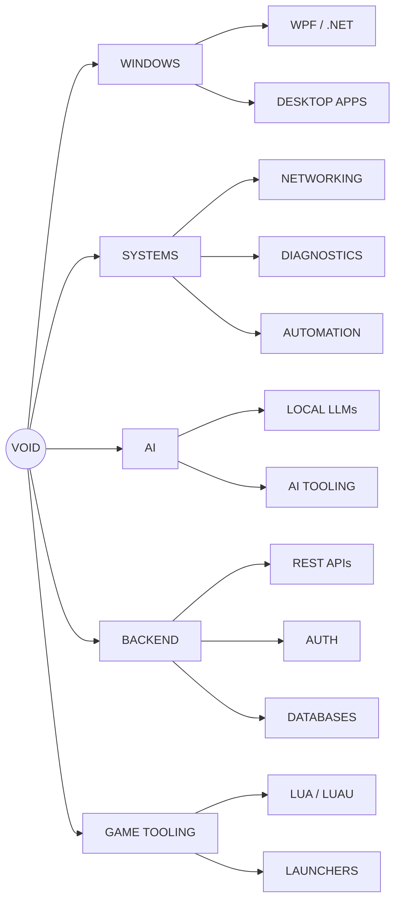

<div align="center">



<br>

<a href="https://github.com/Vvoidddd?tab=followers">
  
</a>


<a href="https://github.com/Vvoidddd?tab=repositories">
  
</a>

<br><br>

`WINDOWS` • `SOFTWARE` • `SYSTEMS` • `AI` • `AUTOMATION`

</div>


# `VOID://IDENTITY`

```yaml
alias: Void
username: Vvoidddd

role:
  - Software Developer
  - Systems Builder

environment:
  os: Windows 11
  editors:
    - Visual Studio
    - VS Code

languages:
  - Python
  - C++
  - C#
  - JavaScript
  - Lua
  - HTML
  - CSS

focus:
  - Windows Development
  - Systems Programming
  - Networking
  - Automation
  - Artificial Intelligence
  - Local LLMs
  - Backend Infrastructure
  - Developer Tools
  - Game Tooling
```

<div align="center">

### `I build things I actually want to use.`

`BUILD` → `BREAK` → `UNDERSTAND` → `IMPROVE`

</div>


# `VOID://PROJECTS`

<table>
<tr>

<td width="50%" valign="top">

## ⚡ VoidLaunch

### Windows Game Launcher

A custom Windows launcher focused on automatically discovering, organizing, and launching installed games.

```text
C# • WPF • .NET 8 • Windows
```

**FEATURES**

- Automatic game scanning
- Executable discovery
- Library management
- Cover artwork
- Favorites
- Recently played
- Custom frameless UI
- Theme engine
- Animated interface

```diff
+ ACTIVE DEVELOPMENT
```

</td>

<td width="50%" valign="top">

## 🛠️ VoidTech

### Windows Technician Toolkit

A Windows diagnostic and repair platform designed to automate repetitive PC troubleshooting and maintenance workflows.

```text
C# • Windows • APIs • Diagnostics
```

**FOCUS**

- Hardware diagnostics
- Windows repair
- Network diagnostics
- System information
- Maintenance automation
- Technician workflows
- Reporting

```diff
+ RESEARCH / DEVELOPMENT
```

</td>

</tr>

<tr>

<td width="50%" valign="top">

## 🔐 VoidHub

### Licensing & Backend Infrastructure

Backend infrastructure for authentication, licensing, device activation, and client/server communication.

```text
Python • Flask • Nginx • SQL
```

```text
VoidTech Client
      │
      ▼
    Nginx
      │
      ▼
 VoidHub API
      │
      ▼
   Database
```

**SYSTEMS**

- License generation
- Device activation
- Machine limits
- Expiration tracking
- Authentication
- Private networking
- API infrastructure

```diff
+ PLANNING / DEVELOPMENT
```

</td>

<td width="50%" valign="top">

## 🛰️ Sentinel Hub

### Lua / Luau Utility Platform

A modular scripting environment centered around custom interfaces and reusable runtime utilities.

```text
Lua • Luau • UI
```

**FOCUS**

- Modular architecture
- Custom UI
- Runtime controls
- Utility framework

### [OPEN REPOSITORY →](https://github.com/Vvoidddd/Sentinel-Hub)

```diff
+ ACTIVE
```

</td>

</tr>
</table>


# `VOID://TECH`

<div align="center">

### Languages


<br><br>

### Frameworks & Runtime


<br><br>

### Systems & Infrastructure


<br><br>

### Development


</div>


# `VOID://TELEMETRY`

<div align="center">

## Contribution Streak


<br><br>

## Developer Overview


<br>


<br><br>

## Language Analytics


</div>


# `VOID://ARCHITECTURE`




# `VOID://REPOSITORIES`

| Repository | Type | Stack | Status |
|---|---|---|---|
| [**Sentinel Hub**](https://github.com/Vvoidddd/Sentinel-Hub) | Utility Hub | `Lua` `Luau` | `ONLINE` |
| [**SSO Script**](https://github.com/Vvoidddd/SSO-Script) | Automation | `Lua` | `ONLINE` |
| [**Lua Obfuscator**](https://github.com/Vvoidddd/Lua-Obfuscator) | Source Transformation | `Lua` | `EXPERIMENTAL` |
| [**macOS RTX Kexts**](https://github.com/Vvoidddd/macOS-RTX-Kexts) | Systems Experiment | `Low-Level` | `EXPERIMENTAL` |


# `VOID://INTERESTS`

<table>
<tr>

<td width="50%" valign="top">

## 🖥️ Windows Development

```text
WPF
.NET
Windows APIs
Process Management
File Systems
System Diagnostics
Custom UI
Automation
```

</td>

<td width="50%" valign="top">

## 🤖 Artificial Intelligence

```text
Local LLMs
LM Studio
Model APIs
Coding Assistants
Agent Systems
Tool Calling
Local Inference
```

</td>

</tr>

<tr>

<td width="50%" valign="top">

## 🌐 Systems & Infrastructure

```text
REST APIs
Nginx
Networking
Authentication
Databases
Private Networks
Client / Server Architecture
```

</td>

<td width="50%" valign="top">

## 🎮 Game Tooling

```text
Launchers
Lua / Luau
Modding
Automation
Asset Management
Custom Interfaces
```

</td>

</tr>
</table>


# `VOID://ROADMAP`

```diff
+ Build more native Windows software
+ Expand VoidLaunch
+ Develop VoidTech
+ Build VoidHub infrastructure
+ Learn deeper systems programming
+ Experiment with local LLM systems
+ Build AI-powered developer tools
+ Learn deeper networking
+ Create better developer tooling
+ Keep turning random ideas into software
```


# `VOID://PHILOSOPHY`

<div align="center">

```text
┌───────────────────────────────────────────────────────────────┐
│                                                               │
│   SOFTWARE IS MORE INTERESTING WHEN YOU UNDERSTAND            │
│   WHAT'S HAPPENING UNDERNEATH IT.                             │
│                                                               │
│            BUILD → BREAK → LEARN → REBUILD                    │
│                                                               │
└───────────────────────────────────────────────────────────────┘
```

</div>


# `VOID://CONNECT`

<div align="center">

<a href="https://github.com/Vvoidddd">

</a>

<a href="https://discord.gg/Mv3CdFKWrD">

</a>

<a href="https://www.roblox.com/users/88469511/profile">

</a>

</div>

<br>


